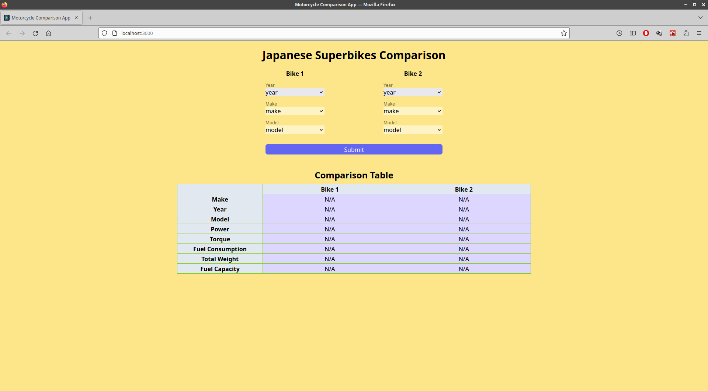
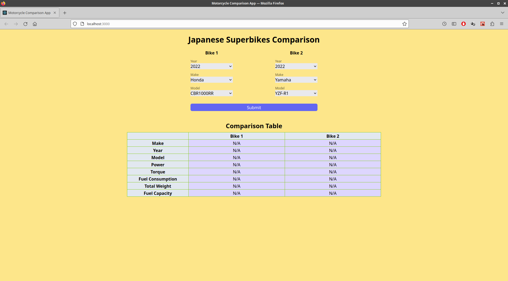
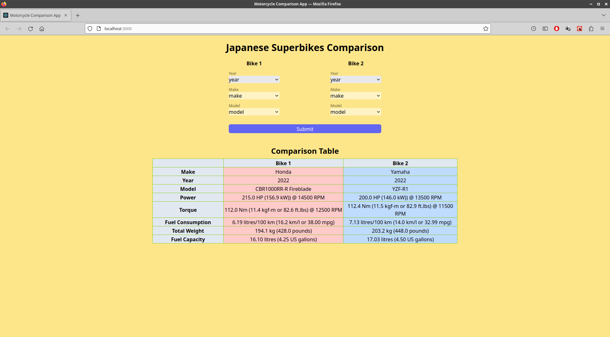
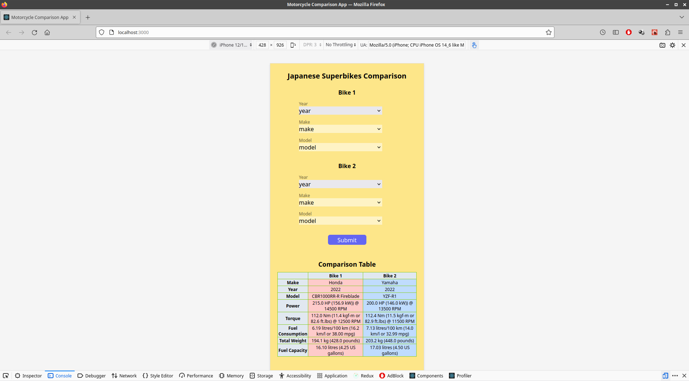

# React Motorcycle Comparison Application using API

## Table of Contents
---
- [Overview](#overview)
- [Built with](#built-with)
- [Features](#features)
- [Things To Be Improved](#things-to-be-improved)

## Overview
---

This is a responsive motorcycle comparison single page application (SPA) using React, Tailwind and an API. A user can pick a set of years, makes and models of motorcycles to compare. After the submit button is clicked, a table shows a comparison of the specifications between two selected motorcycles. To make this project simple, the selections of years, makes, models are limited. 

&nbsp;
### Built With

#### Frontend:
- [React JS](https://reactjs.org/)
- [Tailwind CSS](https://tailwindcss.com/)

#### API:
- [RapidAPI (Motorcycles by API-Ninjas)](https://rapidapi.com/apininjas/api/motorcycles-by-api-ninjas/)

## Features
---
- The page is responsive to any screen sizes including a mobile.
- The cells are highlighted with colors matching with each maker's color (Honda is red, Kawaski is green, Suzuki is yellow, and Yamaha is blue).

## Things To Be Improved
----
1. Allowing more than two motorcycles to be compared
2. Highlighting a cell for better spec on each category such as more horsepower, etc.
3. Adding an option to let the user save the result in variety formats such as Excel, PDF, etc.

